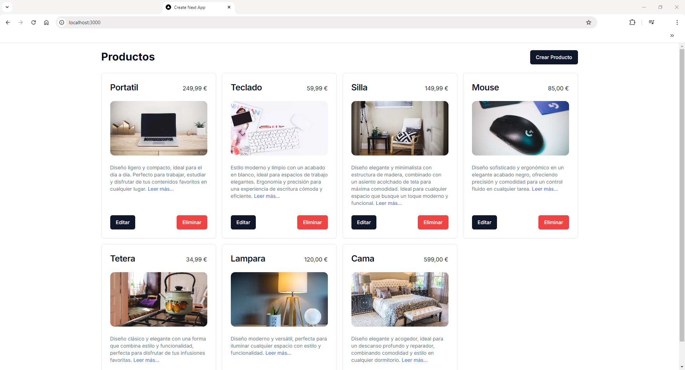

# Proyecto CRUD con Next.js y NestJS

## Inicio

</img>

## Añadir producto

</img>

## Leer más...

</img>

## Actualizar producto

</img>

## Backend - NestJS (backend-nestjs)

Esta sección cubre la configuración y ejecución del backend, que está construido con NestJS. El backend maneja la lógica del servidor y la interacción con la base de datos.

### Configuración

1. **Archivo `.env`**: Crea un archivo llamado `.env` en la raíz del proyecto backend y define las variables de entorno necesarias. La configuración básica para la base de datos debería verse así:

    ```env
    DATABASE_URL="file:./dev.db"
    ```

    - `DATABASE_URL`: La URL de conexión a la base de datos. En este caso, se utiliza una base de datos SQLite almacenada en el archivo `dev.db`.

### Instalación y Ejecución

1. **Instalación de dependencias**: En la raíz del proyecto backend, ejecuta el siguiente comando para instalar las dependencias necesarias:

    ```bash
    npm install
    ```

2. **Ejecución en modo desarrollo**: Para iniciar el servidor en modo desarrollo, usa el siguiente comando:

    ```bash
    npm run start:dev
    ```

## Frontend - Next.js (frontend-next)

Esta sección cubre la configuración y ejecución del frontend, que está construido con Next.js. El frontend se encarga de la interfaz de usuario y la comunicación con el backend.

### Configuración

1. **Archivo `.env`**: Crea un archivo llamado `.env` en la raíz del proyecto frontend y define la URL del backend. La configuración básica debería verse así:

    ```env
    NEXT_PUBLIC_BACKEND_URL=http://localhost:4000
    ```

    - `NEXT_PUBLIC_BACKEND_URL`: La URL del servidor backend al que el frontend se conectará. Asegúrate de que esta URL coincida con la URL en la que tu backend está escuchando.

### Instalación y Ejecución

1. **Instalación de dependencias**: En la raíz del proyecto frontend, ejecuta el siguiente comando para instalar las dependencias necesarias:

    ```bash
    npm install
    ```

2. **Ejecución en modo desarrollo**: Para iniciar el servidor de desarrollo del frontend, usa el siguiente comando:

    ```bash
    npm run dev
    ```